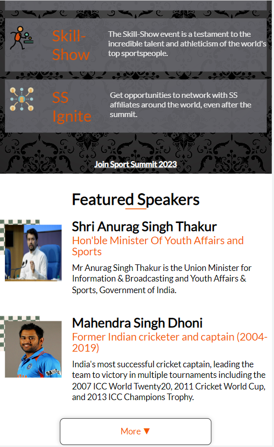
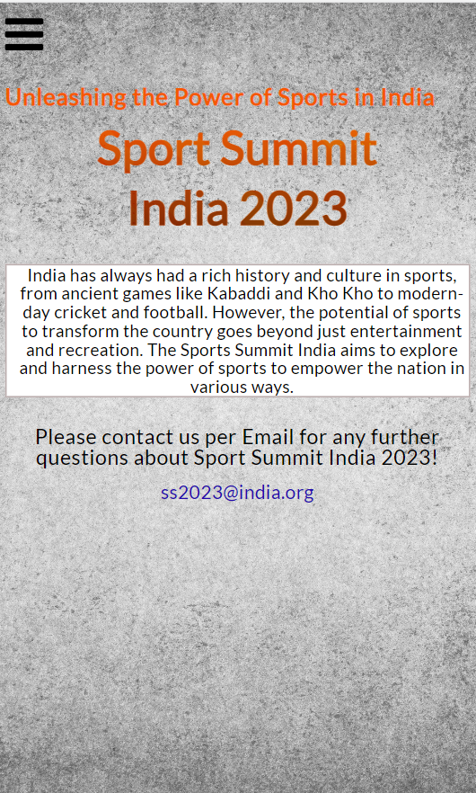
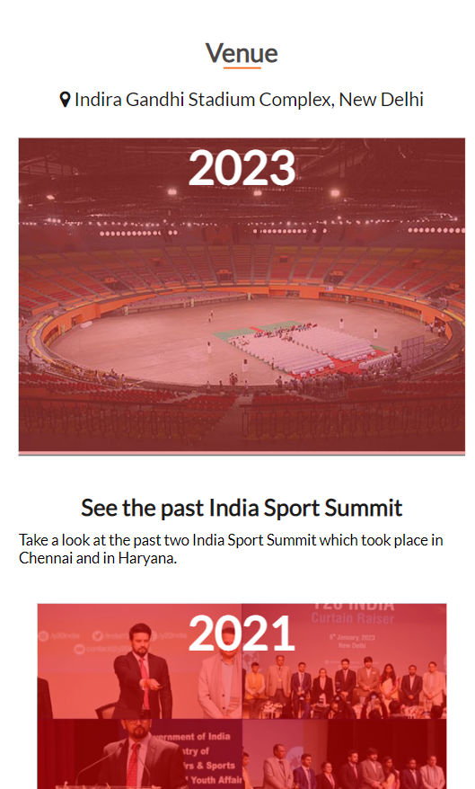
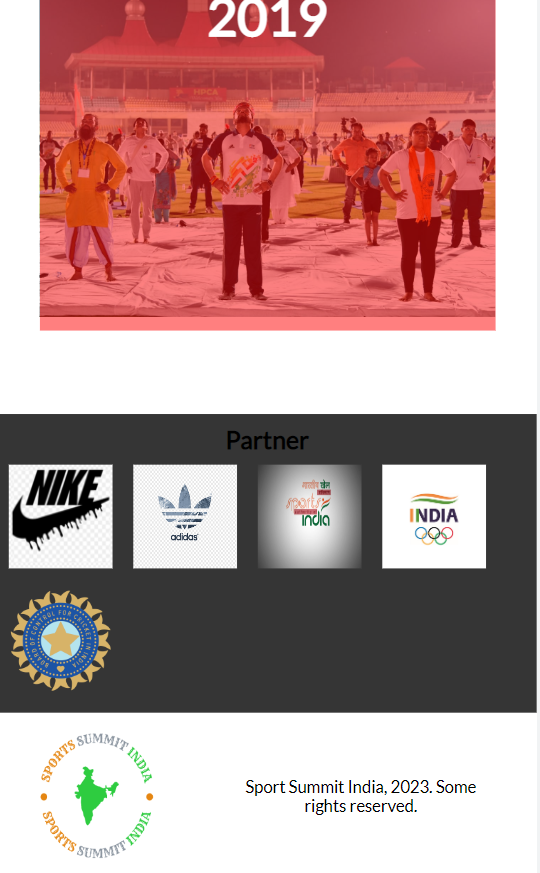

  
   

# 📗 Table of Contents

- [📖 About the Project](#about-project)
  - [🛠 Built With](#built-with)
  - [🚀 Live Demo](#live-demo)
  - [Additional tool]
  - [Deployment](#triangular_flag_on_post-deployment)
- [👥 Authors](#authors)
- [🤝 Contributing](#contributing)
- [⭐️ Show your support](#support)
- [🙏 Acknowledgements](#acknowledgements)
- [📝 License](#license)

# Sport Summit India 2023

> This project is Myfirst Capstone project, I created for Sport Summit India 2023 with HTML,CSS and JavaScript.

> Desktop View:
  
   
  
   
  
   
  

> Mobile View:

  
   
  
   
  
   
  
   
  
   
  
   

## Built With

- Languages: _**HTML, CSS, JavaScript**_
- Technologies used: _**GIT, GITHUB, LINTERS,Netlify**_

## Additional tools
 - Google fonts

## Live Demo
In progress
[See My project Live here](#)

## Authors

<!-- Only Change Username for Different Accounts -->

👤 **Vishal Mishra**
 Platform | Badge |
 --- | --- |
 **GitHub**  | [@Vishal30M](https://github.com/Vishal30M)
 **Twitter** | [@Vismiss30](https://twitter.com/Vismiss30)
 **LinkdIn** | [vishal-kumar-mishra](https://www.linkedin.com/in/vishal-kumar-mishra-0a5226232/)

## 🤝 Contributing

Contributions, issues, and feature requests are welcome!

Feel free to check the [issues page](https://github.com/Vishal30M/Sports-summit-India/issues).

## Show your support

Give a ⭐️ if you like this project!

## Acknowledgments

- The Original UI design idea by [Behance](https://www.behance.net/adagio07) in Behance.

## 📝 License

This project is [MIT](/LICENSE) licensed.